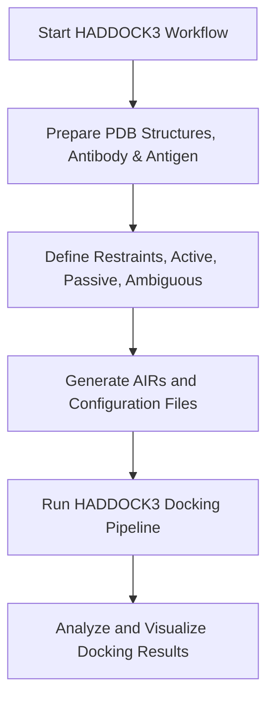

# 3.0 HADDOCK3
In this part of the workshop we'll do some antibody-antigen modelling using HADDOCK3 (the webtool HADDOCK2.4 is a older version). This part is based on one of HADDOCK3's manuals.
Why use HADDOCK3 instead of the HADDOCK2.4?
- High-throughput docking
- Input flexibility
- More customisable

`cd` into the haddock3 folder:

```bash
cd ../haddock3
ls
```


Docked model of 4G6K and 4I1B using HADDOCK3
- Pink: heavy chain 4G6K
	- 4G6K, Specific monoclonal antibody gevokizumab
- Red: light chain 4G6K
- Blue: target protein 4I1B
	- 4I1B, Interleukin-1β (IL-1β)

## Workflow



## 3.1 Installation
Before starting the docking we need to install another tool called [pdb_tools](https://github.com/haddocking/pdb-tools/tree/master).
Simply run:

```bash
pip install pdb-tools
```
## 3.2 Fetching PDB files
Using the installed PDB-tools we will fetch the antibody and antigen structures.

1. Fetch the PDB entry from the PDB database (pdb_fetch).
2. Clean the PDB file (pdb_tidy).
3. Select the chain (pdb_selchain).
4. Remove any hetero atoms from the structure (e.g. crystal waters, small molecules from the crystallisation buffer and such) (pdb_delhetatm).
5. Fix residue numbering insertion in the HV loops (often occuring in antibodies - see note below) (pdb_fixinsert).
6. Remove any possible side-chain duplication (can be present in high-resolution crystal structures in case of multiple conformations of some side chains) (pdb_selaltloc).
7. Keep only the coordinates lines (pdb_keepcoord).
8. Select only the variable domain (FV) of the antibody (to reduce computing time) (pdb_selres).
9. Clean the PDB file (pdb_tidy).

Run the following to create the heavy chain:
```bash
pdb_fetch 4G6K | pdb_tidy -strict | pdb_selchain -H | pdb_delhetatm | pdb_fixinsert | pdb_selaltloc | pdb_keepcoord | pdb_selres -1:120 | pdb_tidy -strict > 4G6K_H.pdb
```
And to create the light chain:
```bash
pdb_fetch 4G6K | pdb_tidy -strict | pdb_selchain -L | pdb_delhetatm | pdb_fixinsert | pdb_selaltloc | pdb_keepcoord | pdb_selres -1:107 | pdb_tidy -strict > 4G6K_L.pdb
```
Combine the Heavy and light chain:
```bash
pdb_merge 4G6K_H.pdb 4G6K_L.pdb | pdb_reres -1 | pdb_chain -A | pdb_chainxseg | pdb_tidy -strict > 4G6K_clean.pdb
```
Prepare the antigen structure:
```bash
pdb_fetch 4I1B | pdb_tidy -strict | pdb_delhetatm | pdb_selaltloc | pdb_keepcoord | pdb_chain -B | pdb_chainxseg | pdb_tidy -strict > 4I1B_clean.pdb
```

## 3.3 Defining restaints for docking

We use restraints in docking to guide the process toward the most likely interaction sites. This reduces the number of wrong models, speeds up the process, and gives more accurate, biologically relevant results.

## 3.4 Identifying the antibodies paratopes
I already ran another tool, [ProABC-2](https://github.com/haddocking/proABC-2), to predict the antibody paratope residues. We will base the restraints on this output. The output residues chosen are those with either an overall probability >= 0.4 or a probability for hydrophobic or hydrophilic > 0.3:

`31,32,33,34,35,52,54,55,56,100,101,102,103,104,105,106,151,152,169,170,173,211,212,213,214,216`

You can visualise this in PyMOL.
- Open the `4G6K_clean.pdb` file.
	- You can use the left panel of MobaXterm to locate the file and open it.
- Run the following commands in the commandline of PyMOL:

```python
color white, all
select paratope, (resi 31+32+33+34+35+52+54+55+56+100+101+102+103+104+105+106+151+152+169+170+173+211+212+213+214+216)
color red, paratope
```
Can you identify the H3 (heavy) loop? (the H3 loop is typically the longest loop)

```python
show surface
```
Are the paratope residues well-defined on the surface?
*Keep this file open*

## 3.5 Identifying the antigens epitope
You can use various tools to predict the epitope of the antigen or NMR chemical shift titration experiments to map the epitope site. I already have prepared the list:

`72,73,74,75,81,83,84,89,90,92,94,96,97,98,115,116,117`

You can visualise this in PyMOL.
- Open the `4I1B_clean.pdb` file.
	- You can use the left panel of MobaXterm to locate the file and open it.
- Run the following commands in the commandline of PyMOL:
```python
color white, all
show surface
select epitope, (resi 72+73+74+75+81+83+84+89+90+92+94+96+97+98+115+116+117)
color red, epitope
show surface
```
Are the epitope residues well-defined on the surface?
*Keep this file open* 

## 3.6 Passive and active residues
As we are never a 100% sure that the binding surface are complete, hence we have to define the active (binding residues) neighbors as `passive`. HADDOCK3 has a command line tool to identify these passive residues, which I also have prepared for you:

`3+24+46+47+48+50+66+76+77+79+80+82+86+87+88+91+93+95+118+119+120`

In the opened `4I1B_clean.pdb` PyMOL session run the following:
```python
select passive, (resi 3+24+46+47+48+50+66+76+77+79+80+82+86+87+88+91+93+95+118+119+120)
color green, passive
```
Are the passive residues well-defined?
*You can now close both PyMOL sessions*

## 3.7 Ambiguous restraints
Next up are the ambiguous restraints which are used when we know the general region of interaction but not the exact atoms or residues. Instead of forcing one specific contact, we give HADDOCK a group of possible contacts, letting it choose the best fit during docking while still staying within the known interaction area. You can view the `.actpass` files where I've pasted in the passive and active residues.

```bash
cat restraints/*.act-pass
```

## 3.8 Ambiguous interaction restrains (AIRs)
Using the previous two files you can make an AIRs file, which will help with the docking process. This is the `ambig-paratope-NMR-epitope.tbl` file in the `restraints` folder.

## 3.9 Additional restaints for multi-chain proteins
As this is an antibody, which consists of two chains, its important to define restraints to keep them together. This is the `antibody-unambig.tbl` file in the `restraints` folder.

## 3.10 Running HADDOCK3
Now we have all the files ready to start the docking process. The HADDOCK3 workflow is the following:
1. `topoaa`: Generates the topologies for the CNS engine and builds missing atoms
2. `rigidbody`: Performs rigid body energy minimisation (it0 in haddock2.x)
3. `caprieval`: Calculates CAPRI metrics (i-RMSD, l-RMSD, Fnat, DockQ) with respect to the top scoring model or reference structure if provided
4. `seletop`: Selects the top X models from the previous module
5. `flexref`: Preforms semi-flexible refinement of the interface (it1 in haddock2.4)
6. `caprieval`
7. `emref`: Final refinement by energy minimisation (itw EM only in haddock2.4)
8. `caprieval`
9. `clustfcc`: Clustering of models based on the fraction of common contacts (FCC)
10. `seletopclusts`: Selects the top models of all clusters
11. `caprieval`
12. `contactmap`: Contacts matrix and a chordchart of intermolecular contacts
`caprieval` is used to compare the models in different stages of the pipeline.
`contactmap` is used to generate contact matrices of the contacts and a chordchart for each cluster.

You can take a look at the configuration file named `docking-antibody-antigen.cfg`:

```bash
cat docking-antibody-antigen.cfg
```

When everything is ready you would execute the HADDOCK3 workflow using `haddock3 docking-antibody-antigen.cfg`. As the docking takes a long time, we'll not run this step.

## 3.11 Analysis
