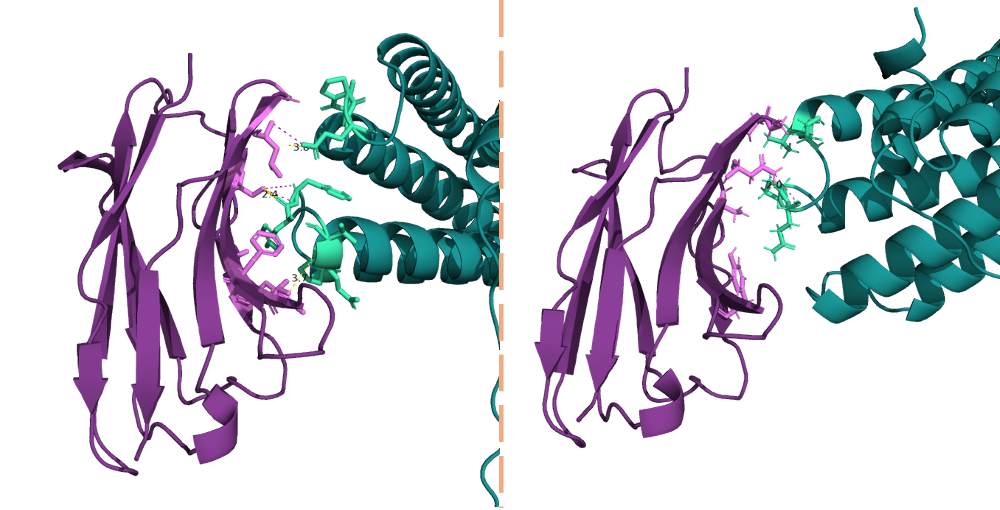

# 4.0 Nanobody design using RFantibody

RFantibody is a pipeline for the structure-based design of _de novo_ antibodies and nanobodies. RFantibody consists of three separate methods:
- Protein backbone design with an antibody-fintuned version of [RFdiffusion](https://www.nature.com/articles/s41586-023-06415-8)
- Protein sequence design with [ProteinMPNN](https://www.science.org/doi/10.1126/science.add2187)
- _In silico_ filtering of designs using an antibody-finetuned version of [RoseTTAFold2](https://www.biorxiv.org/content/10.1101/2023.05.24.542179v1)

> [!NOTE]
> Please keep in mind that the RFantibody pipeline is still in progress and has not been released for use on ALICE.

-----


- Purple: Nanobody, based on the scaffold [3eak](https://www.rcsb.org/structure/3EAK)
- Blue: Target protein, [q9dc58](https://www.uniprot.org/uniprotkb/Q9DC58/entry)
- Green and Pink: The resudues that are in close proximity (>3.5A) of one another, potenially interacting


## 4.1 HLT file format

We must pass structures between the different steps of the RFantibody pipeline. Each step of the pipeline must know:
- The antibody-target complex structure we are currently designing for
- Which chain is the Heavy chain, Light chain, and Target chain (HLT)
- Which residues are in which of the CDR loops

To enable the passing of this information between steps of the pipeline, we define a file format that we call an HLT file. An HLT file is simply a `.pdb` file but with the following modifications:
- The Heavy chain is denoted as chain id 'H'
- The Light chain is denoted as chain id 'L'
- The Target chain(s) are denoted as chain id 'T' (even if there are multiple target chains)
- The order of the chains in the file is Heavy then Light then Target
- At the end of the file are PDB Remarks indicating the 1-indexed absolute (not per-chain) residue index of each of the CDR loops. For example:
  ```
  REMARK PDBinfo-LABEL:   32 H1
  REMARK PDBinfo-LABEL:   52 H2
  ```
### Viewing a HLT file format
So how does it really look, I've provided a nanobody framework PDB in HLT format in [this folder](rfantibody/) called `h-NbBCII10.pdb`
You can run the following in the terminal to view the file, after move yourself into the right folder:

```bash
cd rfantibody
cat h-NbBCII10.pdb
```
- All the way at the bottom you can see the additional information, added to the PDB, needed by the pipeline.

## 4.2 RFdiffusion

The first step in RFantibody is to generate antibody-target docks using an antibody-finetuned version of RFdiffusion. Here is an example command that will run RFdiffusion:
```
# From inside of the rfantibody container

python  /home/src/rfantibody/scripts/rfdiffusion_inference.py \
    --config-name antibody \
    antibody.target_pdb=/home/scripts/examples/example_inputs/rsv_site3.pdb \
    antibody.framework_pdb=/home/scripts/examples/example_inputs/hu-4D5-8_Fv.pdb \
    inference.ckpt_override_path=/home/weights/RFdiffusion_Ab.pt \
    'ppi.hotspot_res=[T305,T456]' \
    'antibody.design_loops=[L1:8-13,L2:7,L3:9-11,H1:7,H2:6,H3:5-13]' \
    inference.num_designs=20 \
    inference.output_prefix=/home/scripts/examples/example_outputs/ab_des
```

Let's go through how this command in more detail to understand what these configs are doing:
- antibody.target_pdb: A path to the target structure that we wish to design antibodies against.
- antibody.framework_pdb: A path to the HLT-formatted antibody framework that we wish to use for our design. RFdiffusion will only design the structure and sequence of regions of the framework which are annotated as loops, this allows us to design the dock and loops of already optimized frameworks.
- inference.ckpt_override_path: The path to the set of RFdiffusion model weights we will use for inference
- ppi.hotspot_res: A list of hotspot residues that define our epitope. These are provided in the same format as in vanilla RFdiffusion. We discuss selecting hotspots in more detail later.
- antibody.design_loops: A dictionary that maps each CDR loop to a range of allowed loop lengths. The length of each loop is sampled uniformly from this range and is sampled independently of the lengths sampled for other loops. If a CDR loop exists in the framework but is not in the dict, this CDR loop will have its sequence and structure fixed during design. If a CDR loop is included in the dict but no range of lengths is provided, this CDR loop will have its sequence and structure designed but only with the length of the loop that is provided in the framework structure.
- inference.num_designs: The number of designs we should generate.
- inference.output_prefix: The prefix of the .pdb file outputs that we will generate.

## 4.3 ProteinMPNN

The second step in RFantibody is to take the docks generated by RFdiffusion and assign sequences to the CDR loops. We do this using the base version of ProteinMPNN, ie. not an antibody-finetuned model. For convenience, we package the necessary ProteinMPNN scripts in this repo and provide a wrapper script that enables the design of just the CDR loops using ProteinMPNN.
At its simplest, ProteinMPNN may be run on a directory of HLT-formatted `.pdb` files using the following command:
```
# From inside of the rfantibody container

python /home/scripts/proteinmpnn_interface_design.py \
    -pdbdir /path/to/inputdir \
    -outpdbdir /path/to/outputdir
```
This will design all CDR loops and will provide one sequence per input structure. There are many more arguments that may be experimented with and are explained by running:
```
python /home/scripts/proteinmpnn_interface_design.py --help
```
Let's go through the proteinMPNN command in more detail:
- pdbdir: The name of a directory of pdbs to run through the model
- quiver: The name of a quiver file to run this metric on.
- outquiver: The name of the quiver file to which output structs will be written
- outpdbdir: The directory to which the output PDB files will be written
- runlist: The path of a list of pdb tags to run (default: ''; Run all PDBs
- checkpoint_name: The name of a file where tags which have finished will be written (default: check.point)
- debug: When active, errors will cause the script to crash and the error message to be printed out (default: False)
- loop_string: The list of loops which you wish to design
- seqs_per_struct: The number of sequences to generate for each structure (default: 1)
- temperature: An a3m file containing the MSA of your target
- augment_eps: The variance of random noise to add to the atomic coordinates (default 0)
- protein_features: What type of protein features to input to ProteinMPNN (default: full)
- omit_AAs: A string of all residue types (one letter case-insensitive) that you would not like to use for design. Letters not corresponding to residue types will be ignored
- num_connections: Number of neighbors each residue is connected to, default 48, higher number leads to better interface design but will cost more to run the model

## 4.4 RF2 (RoseTTAFold2)

The final step of the RFantibody pipeline is to use our antibody-finetuned RF2 to predict the structure of the sequences we just designed. We then assess whether RF2 is confident that the sequence will bind as we designed.
By default this will run with 10 recycling iterations and with 10% of hotspots provided to the model. 

> [!NOTE]
> The developers said: "We don't yet know what combination of these hyperparameters will be most predictive of design success but it should be possible to tune these values once we have data on more antibody and nanobody campaigns."

At it's simplest, RF2 may be run on a directory of HLT-formatted `.pdb` files using the following command:
```
# From inside of the rfantibody container

python /home/scripts/rf2_predict.py \
    input.pdb_dir=/path/to/inputdir \
    output.pdb_dir=/path/to/outputdir
```

### Practical considerations for antibody design

Designing antibodies is similar to designing _de novo_ binders but is in an earlier stage of development. Here we share advice and learnings on how best to use this pipeline to design antibodies which will work experimentally. We expect some of this advice to change as more antibody design campaigns are performed and best-practices crystallize. Several of these sections are adapted from the analogous section of the RFdiffusion README as these two methods share many similarities and the advice applies to both.

### Target site selection

Not every site on a target protein is a good candidate for antibody design. For a site to be an attractive candidate for binding it should have >~3 hydrophobic residues for the binder to interact with. Binding to charged polar sites is still quite hard. Binding to sites with glycans close to them is also hard since they often become ordered upon binding and you will take an energetic hit for that. Binding to unstructured loops has historically been hard but [this paper](https://www.nature.com/articles/s41586-023-06953-1) outlines a strategy to use RFdiffusion to bind unstructured peptides which share much in common unstructured loops, using this strategy should work with antibodies but depending on the flexibility of the loop, you will pay an energetic price for ordering the loop during binding.

### Hotspots

Hotspots are a feature that is integrated into the model to allow for the control of the site on the target which the antibody will interact with. During training, when you classify a target residue as a hotspot if it has an average Cβ distance to the closest 5 antibody CDR residues of less than 8 Angstroms. Of all of the hotspots which are identified on the target 0-100% of these hotspots are actually provided to the model and the rest are masked. RFantibody is more sensitive to exactly which hotspots are selected than vanilla RFdiffusion is.

> [!IMPORTANT]
> Where RFdiffusion tends to generative long helices when given a bad set of hotspots, RFantibody will generally just generate an undocked antibody if a bad set of hotspots is given.

### Choosing CDR lengths

The loop ranges that the developers used for our design campaigns are provided in the RFdiffusion example files. Determining these ranges by looking at the frequency of naturally occuring lengths for each loop and trying to cover most of the density with our range.

### Filtering Strategies

It's recommend to filter based on the following minimal critieria: <br />
<br />
RF2 pAE < 10 <br />
RMSD (design versus RF2 predicted) < 2&#197; <br />
It may also be helpful to filter by Rosetta ddG < -20 <br />
<br />
The lack of an effective filter is the main limitation of the RFantibody pipeline at the moment. The version of RF2 that we provide may show weak enrichment of binders over non-binders in some cases but more data is needed to make this conclusion convincingly. Newly available structure prediction models such as AF3 present a promising alternative to RF2 and we are in the process of evaluating these models for predictivity on our design campaigns.


