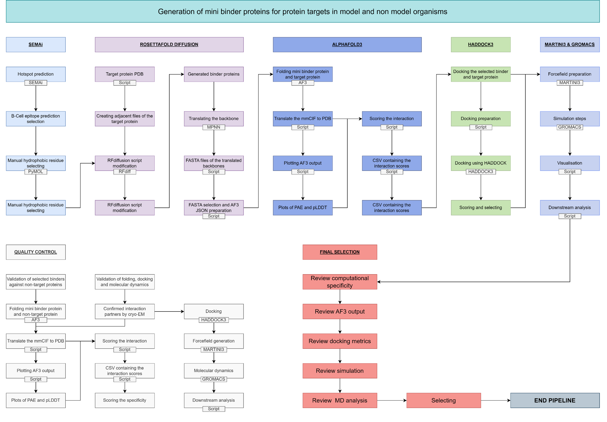

# Workshop
Welcome to the workshop, we're happy to have you.
In this workshop you can do antibody-antigen docking using HADDOCK3, _de novo_ binding-protein design using RFdiffusion and _de novo_ nanobody design using RFantibody.
You can choose what you want to do!



You can start with either:
- 1.0 Binding-protein design, RFdiffusion
	- 2.0 Alphafold3
- 3.0 Antibody-Antigen docking, HADDOCK3
- 4.0 Nanobody design, RFantibody

------

## Install
To follow this workshops workflow, install the following, onto your laptop or computer:
- [PyMOL](https://www.pymol.org/).
- [MobaXterm home edition](https://mobaxterm.mobatek.net/download.html).
	- Log in using the instructions laying around.


## Setup
### 1.0 Folder creation
Lets create your own folder:

```bash
mkdir <your_name>
```
> [!NOTE]
> Please change the <your_name> to your own name!


### 2.0 Moving into the folder
Then move into your freshly made folder by running:

```bash
cd <your_name>
```
> [!NOTE]
> Please change the <your_name> to your own name!


### 3.0 Download files
We will download the files by cloning the github repository onto alice:
This will generate a new folder you can can work in with all the files you need.

```bash
git clone https://github.com/Sir-Corgi/workshop.git
```

> [!NOTE]
> You can move around the directory using:
> - `cd` (change directory).
> 	- Followed by either the directory you want to enter.
> 	- Followed by .. (double dot) to go back one directory.
> - `ls` (look in a directory).
> 	- Followed by either the directory you want to look into.
> 	- Followed by .. (double dot) to see one directory back.

> [!WARNING]
> Please check the box in the bottom left corner that says "Follow terminal folder". This will allow you to click and open files using the mouse.

### 5.0 Move into folder
Run the following, to get into the workshops folder containing everything you need to follow the workshop:
```bash
cd workshop
ls
```
Now you can chose to follow one of the modules I have prepared for you! 
- Binding-protein design, RFdiffusion: please follow these [instructions](RFdiffusion_AF3.md).
	- Alphafold3
- Antibody-Antigen docking, HADDOCK3: please follow these [instructions](Haddock3.md).
- Nanobody design, RFantibody: please follow these [instructions](Nanobody.md).

Have fun, and dont hesitate to ask questions!


-----

## Acknowledgment

If you found this workshop helpful or used any of its materials in your own work, research, or teaching, please consider acknowledging it. A simple note like the following goes a long way:

> “This work is based on materials from a workshop by Jesper ([Sir-Corgi](https://github.com/Sir-Corgi)).”

For a full list of tools and citations used in this workshop, see [CITATIONS.md](CITATIONS.md).

## Contact
For questions or feedback, contact me at j.e.buis@umail.leidenuniv.nl.
