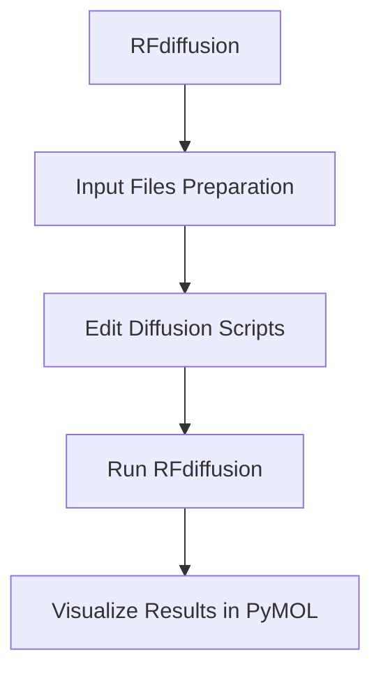
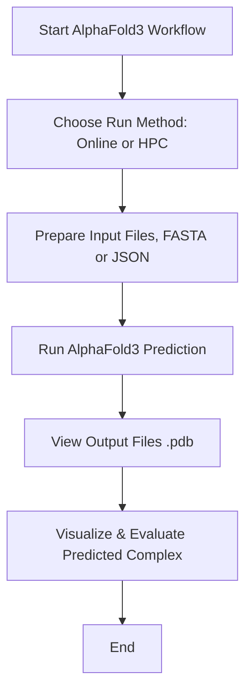

# Workshop
Workshop Atelier, de novo binding-protein and nanobody design
------
## Install
To follow this workshops workflow, install the following, onto your laptop or computer:
- [PyMOL](https://www.pymol.org/)
- [MobaXterm home edition](https://mobaxterm.mobatek.net/download.html)

## Download
Download the files by cloning the github onto alice:
- [Nanobody](nanobody/)
- [Binding-protein](binding-protein/)

```bash
git clone https://github.com/Sir-Corgi/workshop.git
```
This will generate a new folder you can can work in with all the files you need.
You can move around the directory using:
- `cd` (change directory).
	- Followed by either the directory you want to enter.
	- Followed by .. (double dot) to go back one directory.
- `ls` (look in a directory).
	- Followed by either the directory you want to look into.
	- Followed by .. (double dot) to see one directory back.

Please check the box in the bottom left corner that says "Follow terminal folder". This will allow you to click and open files using the mouse.

Run the following
```bash
ls workshop
cd workshop
ls
```
-----
## Workflow


-----

## RFdiffusion

### 1.1 Additional file building
RFdiffusion needs additional files to interpret the geometry and topology of the target protein, guiding the structure generation/design around it.
You will need to run the following:

```bash
module load Miniconda3/24.7.1-0
cd workshop/binding-protein/input/
python /data1/projects/pi-vriesendorpb/shared/RFdiffusion_forked/helper_scripts/make_secstruc_adj.py --input_pdb 2qud.pdb --out_dir ./
```

This will generate two different files:
- `*adj.pt`: the adjacency matrix (as a PyTorch tensor), encoding spatial proximity of residues.
- `*ss.pt`: the secondary structure annotations, often derived from DSSP.

### 1.2 Updating the running script
Run the following to view the script we'll run for the RFdiffusion for a binder-protein for our target protein:

```bash
cat rfdiffusion_hp1.sh
```

Change the scripts to match with the potential hotspots, you can run:

```bash
sed -i 's/placeholder/A5,A9,A10,A11,A12/g' rfdiffusion_hp1.sh
sed -i 's/placeholder/B5,B8,B9,B10,B11/g' rfdiffusion_hp2.sh
```
#### Note
I already have identified some hotspots of the protein we're currently working on, [2QUD](https://www.rcsb.org/structure/2QUD), PP7 bacteriophage coat protein in complex, a part of [1DWN](https://www.rcsb.org/structure/1DWN):

- pink: hotspot 1, residues: A5,A9,A10,A11,A12
- green: hotspot 2, residues: B5,B8,B9,B10,B11

To visualise the change of the script, you can run to following to confirm the changes:

```bash
cat rfdiffusion_hp1.sh
```
*Can you spot the difference?*

### 1.3 Running RFdiffusion
Now we are all set to run the diffusion script. This step will take around 6 minutes to generate a binding-protein.

```bash
sbatch rfdiffusion_hp1.sh
sbatch rfdiffusion_hp2.sh
```

You can view the progress by running: `squeue --me`.

### 1.4 Visualisation of the binding-protein
After running RFdiffusion you can now visualise the `pdb` files using PyMOL.

```bash
cd ../output
```

Now on the left of the screen you can see the files, dubble click the pdb files. the file will open in PyMOL.
- How does it look?
- Did it generate a binding-protein near the hotspot?
- Is there a difference between the hp1 and hp2?
Advanced users:
- When viewing the protein sequence, what do you notice about the sequence of the binding-protein, compared to the target protein?

**After this you can close pymol.**

------

## AlphaFold3
I've provided you with the fasta files and json files to run AlphaFold3. You can either copy and paste the sequences into the [webserver of alphafold3](https://alphafoldserver.com/) or you can run them on the HPC (high preformance computer) ALICE. The locally installed requires another type of input that I have provided in the [input folder](binding-protein/alphafold3/) and is called `alphafold3input.json`.

### Workflow




### 2.0 Running online 
- Copy the fasta sequences of `2qud.fasta`, `binder_hp1.fasta` and, `binder_hp2.fasta` in the alphafold3 folder.
- Paste the sequence for 2qud and one of the two binding-proteins.
- Run en preview the job.
	- Repeat step 2 for the other binding-protein.
- Review the complex:
	- What do you see?
	- Did AF3 predict the bindingsite like in the first part of the workshop?
#### Note
Do you want to learn more about alphafold3 and what you can do with it dont hesitate to ask, there is also a more detailed workshop given "Using AlphaFold on local HPC ALICE for upscaling and better predictions".

### 2.1 Running on HPC
First move to the right folder (directory) using the command `cd`. Using `ls` you can look in the directory youre currently in.

```bash
ls
cd ../alphafold3
```
#### 2.2
View the `.json` files.

```bash
cat *.json
```
This is the format AF3 wants to have the sequences inputted.

#### 2.3
Now we are ready to run the AF3 prediction.
```bash
sbatch afprediction_hp1.sh
sbatch afprediction_hp2.sh
```
This will take around 10-45mins to complete, hence I have prepared the output for you.

#### 2.4
Now move to the output folder
```bash
cd output
ls
```
There are two folders each containing all the run details and files of each prediction, you can use the left side of MobaXterm to double click and open de folders and also the `.pdb` files.
- What do you see?
- Did AF3 predict the bindingsite like in the first part of the workshop?

*You can close pymol again*

## HADDOCK3


