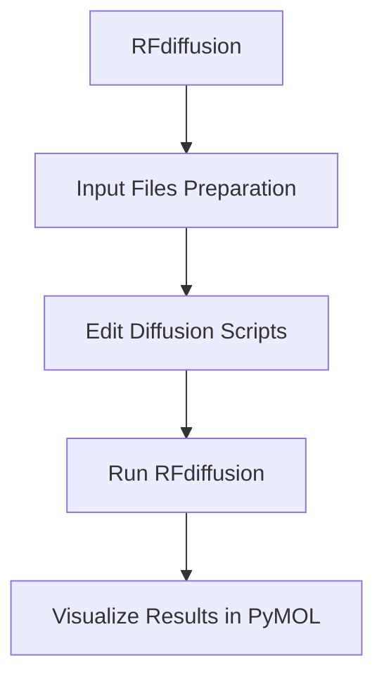

# Workshop
Workshop Atelier, de novo binding-protein and nanobody design
------
## Install
To follow this workshops workflow, install the following, onto your laptop or computer:
- [PyMOL](https://www.pymol.org/)
- [MobaXterm home edition](https://mobaxterm.mobatek.net/download.html)

## Download
Download the files by cloning the github onto alice:
- [Nanobody](nanobody/)
- [Binding-protein](binding-protein/)

```bash
git clone https://github.com/Sir-Corgi/workshop.git
```
This will generate a new folder you can can work in with all the files you need.
You can move around the directory using:
- `cd` (change directory).
	- Followed by either the directory you want to enter.
	- Followed by .. (double dot) to go back one directory.
- `ls` (look in a directory).
	- Followed by either the directory you want to look into.
	- Followed by .. (double dot) to see one directory back.
Run the following
```bash
ls workshop
cd workshop
ls
```
-----
## Workflow


-----

## RFdiffusion

### 1.1 Additional file building
RFdiffusion needs additional files to interpret the geometry and topology of the target protein, guiding the structure generation/design around it.
You will need to run the following:

```bash
module load Miniconda3/24.7.1-0
cd workshop/binding-protein/input/
python /data1/projects/pi-vriesendorpb/shared/RFdiffusion_forked/helper_scripts/make_secstruc_adj.py --input_pdb 2qud.pdb --out_dir ./
```

This will generate two different files:
- `*adj.pt`: the adjacency matrix (as a PyTorch tensor), encoding spatial proximity of residues.
- `*ss.pt`: the secondary structure annotations, often derived from DSSP.

### 1.2 Updating the running script
Run the following to view the script we'll run for the RFdiffusion for a binder-protein for our target protein:

```bash
cat rfdiffusion_hp1.sh
```

Change the scripts to match with the potential hotspots, you can run:

```bash
sed -i 's/placeholder/A0,A5,A9,A10,A11,A12/g' rfdiffusion_hp1.sh
sed -i 's/placeholder/B5,B8,B9,B10,B11/g' rfdiffusion_hp2.sh
```

To visualise the change of the script, you can run to following to confirm the changes:

```bash
cat rfdiffusion_hp1.sh
```
*Can you spot the difference?*

### 1.3 Running RFdiffusion
Now we are all set to run the diffusion script. This step will take around 6 minutes to generate a binding-protein.

```bash
sbatch rfdiffusion_hp1.sh
sbatch rfdiffusion_hp2.sh
```

You can view the progress by running: `squeue --me`.

### 1.4 Visualisation of the binding-protein
After running RFdiffusion you can now visualise the `pdb` files using PyMOL.

```bash
cd ../output
```

Now on the left of the screen you can see the files, dubble click the pdb files. the file will open in PyMOL.
- How does it look?
- Did it generate a binding-protein near the hotspot?
- Is there a difference between the hp1 and hp2?
Advanced users:
- When viewing the protein sequence, what do you notice about the sequence of the binding-protein, compared to the target protein?

**After this you can close pymol.**

------

## AlphaFold3
On to the second part of the workshop. I've provided you with the fasta files and json files to run AlphaFold3.
