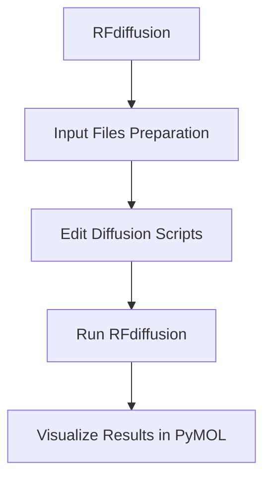
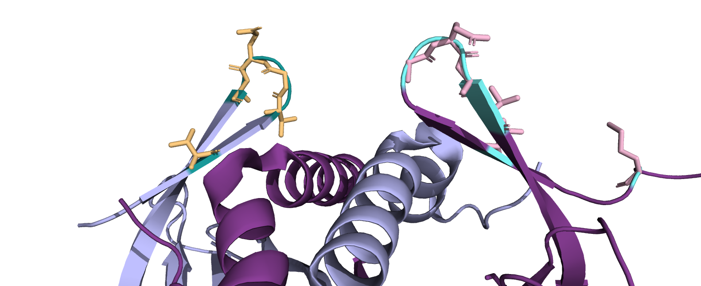
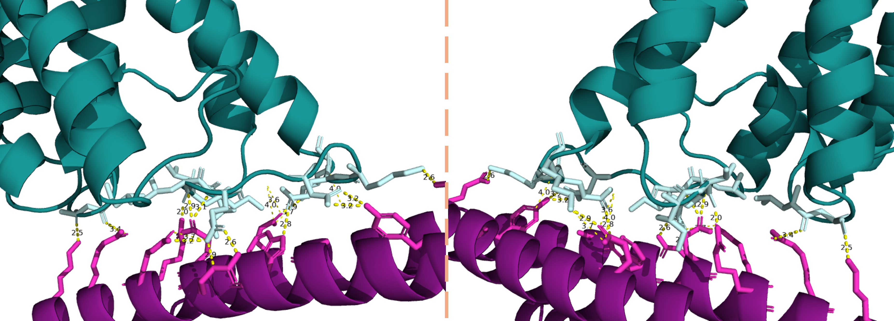
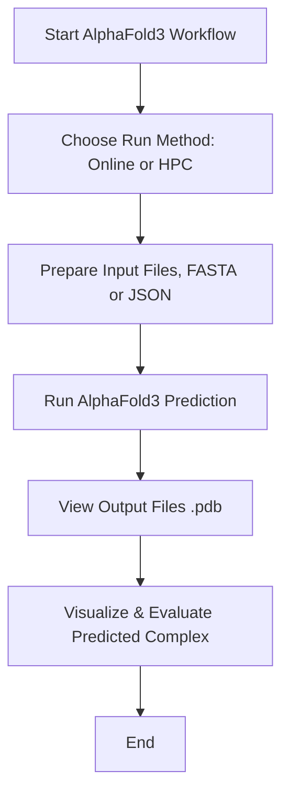
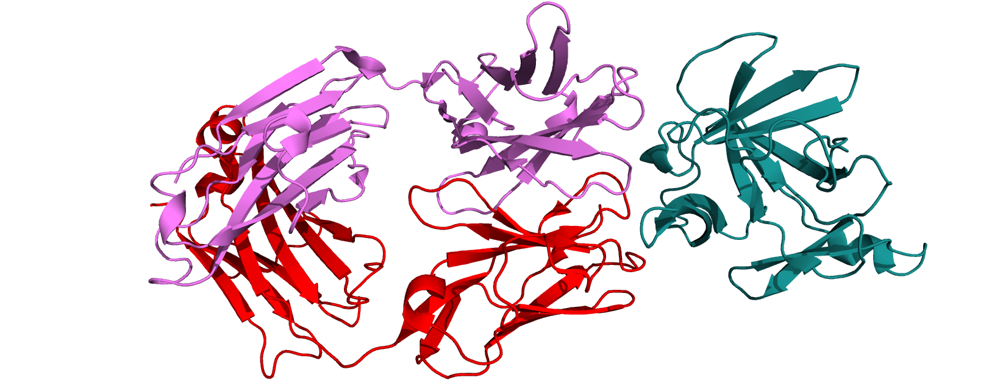
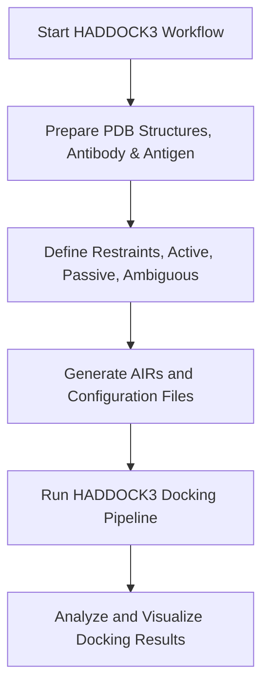

# Workshop
Welcome to the workshop, we're happy to have you.
In this workshop we'll do protein-protein docking using HADDOCK3, de novo binding-protein and nanobody design.

------

## Install
To follow this workshops workflow, install the following, onto your laptop or computer:
- [PyMOL](https://www.pymol.org/)
- [MobaXterm home edition](https://mobaxterm.mobatek.net/download.html)

## Download
Download the files by cloning the github onto alice:

```bash
git clone https://github.com/Sir-Corgi/workshop.git
```

This will generate a new folder you can can work in with all the files you need.
You can move around the directory using:
- `cd` (change directory).
	- Followed by either the directory you want to enter.
	- Followed by .. (double dot) to go back one directory.
- `ls` (look in a directory).
	- Followed by either the directory you want to look into.
	- Followed by .. (double dot) to see one directory back.

Please check the box in the bottom left corner that says "Follow terminal folder". This will allow you to click and open files using the mouse.

Run the following
```bash
ls workshop
cd workshop
ls
```
-----

## 1.0 RFdiffusion

### Workflow



### 1.1 Additional file building
RFdiffusion needs additional files to interpret the geometry and topology of the target protein, guiding the structure generation/design around it.
You will need to run the following:

```bash
module load Miniconda3/24.7.1-0
cd workshop/binding-protein/input/
python /data1/projects/pi-vriesendorpb/shared/RFdiffusion_forked/helper_scripts/make_secstruc_adj.py --input_pdb 2qud.pdb --out_dir ./
```

This will generate two different files:
- `*adj.pt`: the adjacency matrix (as a PyTorch tensor), encoding spatial proximity of residues.
- `*ss.pt`: the secondary structure annotations, often derived from DSSP.

### 1.2 Updating the running script
Run the following to view the script we'll run for the RFdiffusion for a binder-protein for our target protein:

```bash
cat rfdiffusion_hp1.sh
```

Change the scripts to match with the potential hotspots, you can run:

```bash
sed -i 's/placeholder/A5,A9,A10,A11,A12/g' rfdiffusion_hp1.sh
sed -i 's/placeholder/B5,B8,B9,B10,B11/g' rfdiffusion_hp2.sh
```
#### Note
I already have identified some hotspots of the protein we're currently working on, [2QUD](https://www.rcsb.org/structure/2QUD), PP7 bacteriophage coat protein in complex, a part of [1DWN](https://www.rcsb.org/structure/1DWN):

Identified hotspots of 2QUD
- purple and light blue: 2QUD as homodimer.
- pink: hotspot 1, residues: A5,A9,A10,A11,A12.
- yellow: hotspot 2, residues: B5,B8,B9,B10,B11.

To visualise the change we just made in the script, you can run to following to confirm the changes:

```bash
cat rfdiffusion_hp1.sh
```
*Can you spot the difference?*

### 1.3 Running RFdiffusion
Now we are all set to run the diffusion script. This step will take around 6 minutes to generate a binding-protein.

```bash
sbatch rfdiffusion_hp1.sh
sbatch rfdiffusion_hp2.sh
```

You can view the progress by running: `squeue --me`.

### 1.4 Visualisation of the binding-protein
After running RFdiffusion you can now visualise the `pdb` files using PyMOL.

```bash
cd ../output
```

Now on the left of the screen you can see the files, dubble click the pdb files. the file will open in PyMOL.
- How does it look?
- Did it generate a binding-protein near the hotspot?
- Is there a difference between the hp1 and hp2?
Advanced users:
- When viewing the protein sequence, what do you notice about the sequence of the binding-protein, compared to the target protein?

**After this you can close pymol.**

------

## 2.0 AlphaFold3
I've provided you with the fasta files and json files to run AlphaFold3. You can either copy and paste the sequences into the [webserver of alphafold3](https://alphafoldserver.com/) or you can run them on the HPC (high preformance computer) ALICE. The locally installed requires another type of input that I have provided in the [input folder](binding-protein/alphafold3/) and is called `alphafold3input.json`.


AlphaFold3 prediction of a target protein and de novo generated binding-protein with interaction prediction.
- Blue: target protein
- Purple: de novo binding-protein
- Light blue and pink: predicted interacting residues.

### Workflow

### 2.1 Running online 
- Copy the fasta sequences of `2qud.fasta`, `binder_hp1.fasta` and, `binder_hp2.fasta` in the alphafold3 folder.
- Paste the sequence for 2qud and one of the two binding-proteins.
- Run en preview the job.
	- Repeat step 2 for the other binding-protein.
- Review the complex:
	- What do you see?
	- Did AF3 predict the bindingsite like in the first part of the workshop?
#### Note
Do you want to learn more about alphafold3 and what you can do with it dont hesitate to ask, there is also a more detailed workshop given "Using AlphaFold on local HPC ALICE for upscaling and better predictions".

### 2.2 Running on HPC
First move to the right folder (directory) using the command `cd`. Using `ls` you can look in the directory youre currently in.

```bash
ls
cd ../../alphafold3
```
#### 2.3
View the `.json` files.

```bash
cat *.json
```
This is the format AF3 wants to have the sequences inputted.

#### 2.4
Now we are ready to run the AF3 prediction.
```bash
sbatch afprediction_hp1.sh
sbatch afprediction_hp2.sh
```
This will take around 10-45mins to complete, hence I have prepared the output for you.

#### 2.5
Now move to the output folder
```bash
cd output
ls
```
There are two folders each containing all the run details and files of each prediction, you can use the left side of MobaXterm to double click and open de folders and also the `.pdb` files.
- What do you see?
- Did AF3 predict the bindingsite like in the first part of the workshop?

*You can close pymol again*

-------

## 3.0 HADDOCK3
In this part of the workshop we'll do some antibody-antigen modelling using HADDOCK3 (the webtool HADDOCK2.4 is a older version). This part is based on one of HADDOCK3's manuals.
Why use HADDOCK3 instead of the HADDOCK2.4?
- High-throughput docking
- Input flexibility
- More customisable
`cd` into the haddock3 folder:
```bash
cd ../haddock3
ls
```


Docked model of 4G6K and 4I1B using HADDOCK3
- Pink: heavy chain 4G6K
	- 4G6K, Specific monoclonal antibody gevokizumab
- Red: light chain 4G6K
- Blue: target protein 4I1B
	- 4I1B, Interleukin-1β (IL-1β)

### Workflow



### 3.1 Installation
Before starting the docking we need to install another tool called [pdb_tools](https://github.com/haddocking/pdb-tools/tree/master).
Simply run:

```bash
pip install pdb-tools
```
### 3.2 Fetching PDB files
Using the installed PDB-tools we will fetch the antibody and antigen structures.

1. Fetch the PDB entry from the PDB database (pdb_fetch).
2. Clean the PDB file (pdb_tidy).
3. Select the chain (pdb_selchain).
4. Remove any hetero atoms from the structure (e.g. crystal waters, small molecules from the crystallisation buffer and such) (pdb_delhetatm).
5. Fix residue numbering insertion in the HV loops (often occuring in antibodies - see note below) (pdb_fixinsert).
6. Remove any possible side-chain duplication (can be present in high-resolution crystal structures in case of multiple conformations of some side chains) (pdb_selaltloc).
7. Keep only the coordinates lines (pdb_keepcoord).
8. Select only the variable domain (FV) of the antibody (to reduce computing time) (pdb_selres).
9. Clean the PDB file (pdb_tidy).

Run the following to create the heavy chain:
```bash
pdb_fetch 4G6K | pdb_tidy -strict | pdb_selchain -H | pdb_delhetatm | pdb_fixinsert | pdb_selaltloc | pdb_keepcoord | pdb_selres -1:120 | pdb_tidy -strict > 4G6K_H.pdb
```
And to create the light chain:
```bash
pdb_fetch 4G6K | pdb_tidy -strict | pdb_selchain -L | pdb_delhetatm | pdb_fixinsert | pdb_selaltloc | pdb_keepcoord | pdb_selres -1:107 | pdb_tidy -strict > 4G6K_L.pdb
```
Combine the Heavy and light chain:
```bash
pdb_merge 4G6K_H.pdb 4G6K_L.pdb | pdb_reres -1 | pdb_chain -A | pdb_chainxseg | pdb_tidy -strict > 4G6K_clean.pdb
```
Prepare the antigen structure:
```bash
pdb_fetch 4I1B | pdb_tidy -strict | pdb_delhetatm | pdb_selaltloc | pdb_keepcoord | pdb_chain -B | pdb_chainxseg | pdb_tidy -strict > 4I1B_clean.pdb
```

### 3.3 Defining restaints for docking

We use restraints in docking to guide the process toward the most likely interaction sites. This reduces the number of wrong models, speeds up the process, and gives more accurate, biologically relevant results.

#### 3.3 Identifying the antibodies paratopes
I already ran another tool, [ProABC-2](https://github.com/haddocking/proABC-2), to predict the antibody paratope residues. We will base the restraints on this output. The output residues chosen are those with either an overall probability >= 0.4 or a probability for hydrophobic or hydrophilic > 0.3.
`31,32,33,34,35,52,54,55,56,100,101,102,103,104,105,106,151,152,169,170,173,211,212,213,214,216`

You can visualise this in PyMOL.
- Open the `4G6K_clean.pdb` file.
	- You can use the left panel of MobaXterm to locate the file and open it.
- Run the following commands in the commandline of PyMOL:

```python
color white, all
select paratope, (resi 31+32+33+34+35+52+54+55+56+100+101+102+103+104+105+106+151+152+169+170+173+211+212+213+214+216)
color red, paratope
```
Can you identify the H3 (heavy) loop? (the H3 loop is typically the longest loop)

```python
show surface
```
Are the paratope residues well-defined on the surface?
*Keep this file open*

#### 3.4 Identifying the antigens epitope
You can use various tools to predict the epitope of the antigen or NMR chemical shift titration experiments to map the epitope site. I already have prepared the list.
`72,73,74,75,81,83,84,89,90,92,94,96,97,98,115,116,117`

You can visualise this in PyMOL.
- Open the `4I1B_clean.pdb` file.
	- You can use the left panel of MobaXterm to locate the file and open it.
- Run the following commands in the commandline of PyMOL:
```python
color white, all
show surface
select epitope, (resi 72+73+74+75+81+83+84+89+90+92+94+96+97+98+115+116+117)
color red, epitope
show surface
```
Are the epitope residues well-defined on the surface?
*Keep this file open* 

### 3.5 Passive and active residues
As we are never a 100% sure that the binding surface are complete, hence we have to define the active (binding residues) neighbors as `passive`. HADDOCK3 has a command line tool to identify these passive residues, which I also have prepared for you. 
`3+24+46+47+48+50+66+76+77+79+80+82+86+87+88+91+93+95+118+119+120`

In the opened `4I1B_clean.pdb` PyMOL session run the following:
```python
select passive, (resi 3+24+46+47+48+50+66+76+77+79+80+82+86+87+88+91+93+95+118+119+120)
color green, passive
```
Are the passive residues well-defined?
*You can now close both PyMOL sessions*

### 3.6 Ambiguous restraints
Next up are the ambiguous restraints which are used when we know the general region of interaction but not the exact atoms or residues. Instead of forcing one specific contact, we give HADDOCK a group of possible contacts, letting it choose the best fit during docking while still staying within the known interaction area. You can view the `.actpass` files where I've pasted in the passive and active residues.

```bash
cat restraints/*.act-pass
```

### 3.7 Ambiguous interaction restrains (AIRs)
Using the previous two files you can make an AIRs file, which will help with the docking process. This is the `ambig-paratope-NMR-epitope.tbl` file in the `restraints` folder.

#### 3.8 Additional restaints for multi-chain proteins
As this is an antibody, which consists of two chains, its important to define restraints to keep them together. This is the `antibody-unambig.tbl` file in the `restraints` folder.

### 3.9 Running HADDOCK3
Now we have all the files ready to start the docking process. The HADDOCK3 workflow is the following:
1. `topoaa`: Generates the topologies for the CNS engine and builds missing atoms
2. `rigidbody`: Performs rigid body energy minimisation (it0 in haddock2.x)
3. `caprieval`: Calculates CAPRI metrics (i-RMSD, l-RMSD, Fnat, DockQ) with respect to the top scoring model or reference structure if provided
4. `seletop`: Selects the top X models from the previous module
5. `flexref`: Preforms semi-flexible refinement of the interface (it1 in haddock2.4)
6. `caprieval`
7. `emref`: Final refinement by energy minimisation (itw EM only in haddock2.4)
8. `caprieval`
9. `clustfcc`: Clustering of models based on the fraction of common contacts (FCC)
10. `seletopclusts`: Selects the top models of all clusters
11. `caprieval`
12. `contactmap`: Contacts matrix and a chordchart of intermolecular contacts
`caprieval` is used to compare the models in different stages of the pipeline.
`contactmap` is used to generate contact matrices of the contacts and a chordchart for each cluster.

You can take a look at the configuration file named `docking-antibody-antigen.cfg`:

```bash
cat docking-antibody-antigen.cfg
```
When everything is ready you would execute the HADDOCK3 workflow using `haddock3 <configuration_file>`. As the docking takes a long time, we'll not run this step.

### 3.10 Analysis


